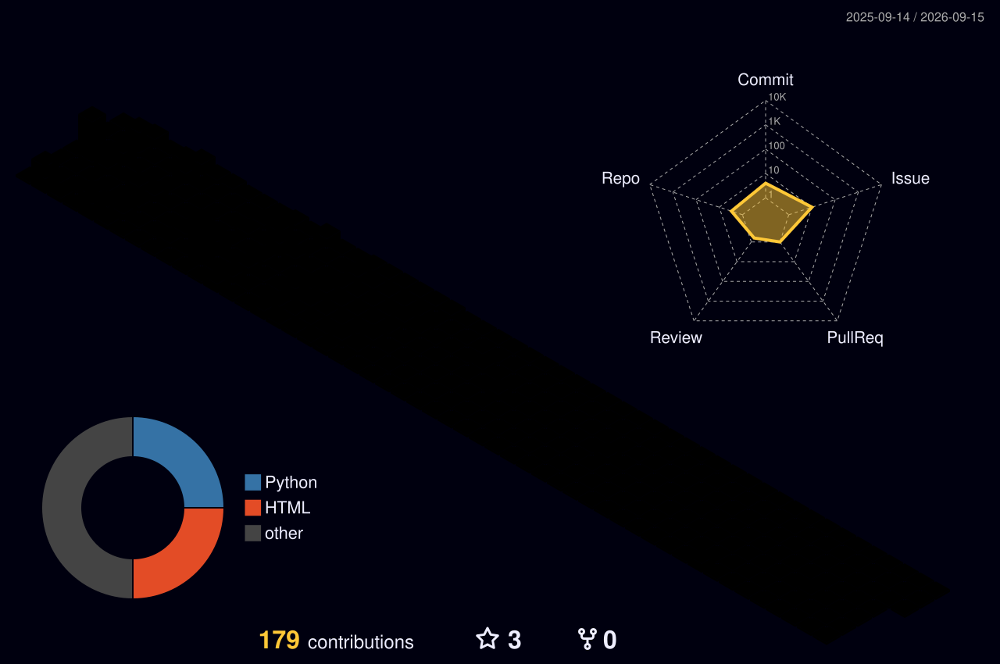

  

<!--访问次数-->

<!--     &emsp;
    &emsp;
    &emsp;
    &emsp;
    &emsp;
    &emsp;
    &emsp; -->

## Self-Introduction

<!--  
- 🌱 Undergraduate in CS2201 (HONOR), of QianXuesen College, Xi'an Jiaotong University (2022.09 - present)
- 🔭 NUS  (2024.06 - 2024.07)
- 👯 I’m looking to collaborate on ...
- 🤔 I’m looking for help with ...
- 💬 Ask me about ...
- 📫 How to reach me: ...
- 😄 Pronouns: ...
- ⚡ Fun fact: ...-->
Hi, I'm Sy Zheng, a data enthusiast focused on machine learning and graph-based recommendation systems.      

## Education
`2022.09 - 2026.06` B.S. in Computer Science and Technology Experimental Class, ___Xi'an Jiaotong University___       

## Miscellaneous

<!--Line跑码线-->
<!--

<!--
<!--贡献速度-->
<!--

<!--Github奖杯数据展示-->

 

